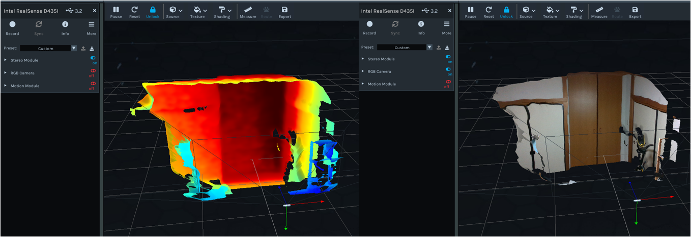
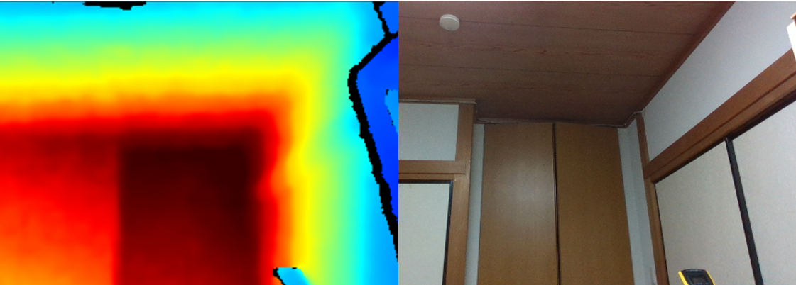

# dockerfiles

Dockerfileおよびメモ

DockerHubにイメージを公開してます.

不定期でバグ込み＆修正アップデートしているので、タイミングよっては動作しない可能性がある.

https://hub.docker.com/repositories/chihiro1234567

## Ubuntu20
---

Ubuntu 20.04をベースとしたミニマム、開発関連を追加したイメージ. 

ubuntu(uid=1000,gid=1000)をsudo権限付きで追加

```
docker pull chihiro1234567/ubuntu20:min-1.0
docker pull chihiro1234567/ubuntu20:dev-1.0
```

`-u  $(id -u):$(id -g)`で起動すると、コンテナ内のubuntuユーザのIDをホストのIDに書き換えて起動します.

ホストのディレクトリをマウントした場合、そこでファイルを生成してコンテナを終了しても自分のパーミッションでファイルが残ります.

```
chihiro > docker run -it --rm -u $(id -u):$(id -g) -v ${PWD}:/home/work chihiro1234567/ubuntu20:dev-1.0 bash

$ ubuntu@6c00bec4f1c0:~$ id
$ uid=1012(ubuntu) gid=100(users) groups=100(users)
$ cd /home/work
$ touch test.txt
$ exit
chihiro > ls -l text.txt
-rw-r--r-- 1 chihiro users    0  2月 12 10:52 test.txt
```

ユーザを指定しないとrootでログインします.

```
> docker run -it --rm chihiro1234567/ubuntu20:dev-1.0
$ root@e710f165d2fe:~# id
$ uid=0(root) gid=0(root) groups=0(root)
```


## Ros2-foxy, Realsense
---

ros2-foxyとlibrealsense, realsense-rosパッケージをインストールしたイメージ.

https://github.com/IntelRealSense/librealsense/releases/tag/v2.51.1

コンテナ内でGUIを使う方法を以下のリポジトリを参考にしました.

https://github.com/2b-t/realsense-ros2-docker

```
> docker pull chihiro1234567/ros2-foxy:base-1.3
> docker run -it --rm -u $(id -u):$(id -g) chihiro1234567/ros2-foxy:base-1.3 bash
$ ros2 ...
```

イメージのpullとこのリポジトリからdocker-composeファイルを取得.

```bash
> docker pull chihiro1234567/ros2-foxy:realsense251-1.3
> git clone git@github.com:chihiro1234567/dockerfiles.git
> cd dockerfiles/ros2-foxy
```

Realsenseデバイスを接続して、`ros2-realsense-container`コンテナを起動する.

```bash
> docker compose -f docker-compose-realsense.yml up -d
> docker compose -f docker-compose-realsense.yml ps
NAME                       IMAGE                                       COMMAND                 SERVICE         CREATED        STATUS
ros2-realsense-container   chihiro1234567/ros2-foxy:realsense251-1.3   "/entrypoint.sh bash"   realsense_ros2  7 seconds ago  Up 6 seconds        
```
> 重要) コンテナ使う前に`xhost`を実行しておく必要がある. (`No Protocol`エラーが出る)

```bash
> sudo xhost +
```

realsense-viewerの実行.ワーニングがいろいろ出るが未調査.

```bash
> docker exec ros2-realsense-container realsense-viewer
```
3D

2D


rviz2はrootではなく、ユーザアカウントで中から実行したらうまくいった.(setup.bashを実行しているから？)

```bash
> docker exec -it -u $(id -u):$(id -g) ros2-realsense-container bash
$ rviz2
```

docker-compose-realsense.ymlにはカレントディレクトリを`/home/work`にマウントする設定が追加されている

```bash
> ls
> {ホスト側のディレクトリ・ファイル}
> docker exec -it -u $(id -u):$(id -g) ros2-realsense-container bash
$ cd /home/work
$ ls
$ {ホスト側のディレクトリ・ファイル}
```
